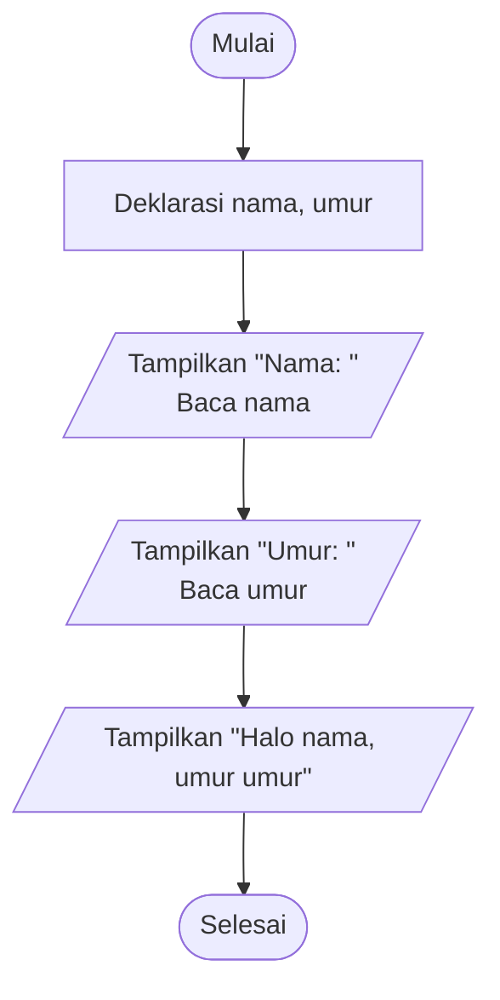
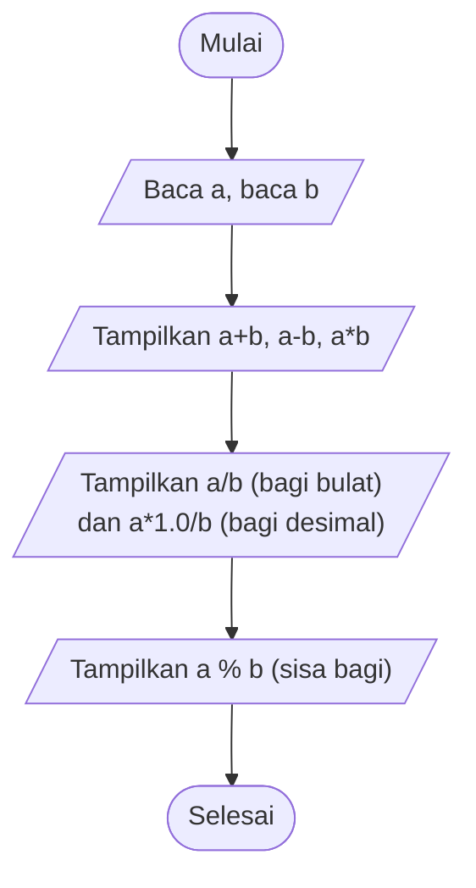
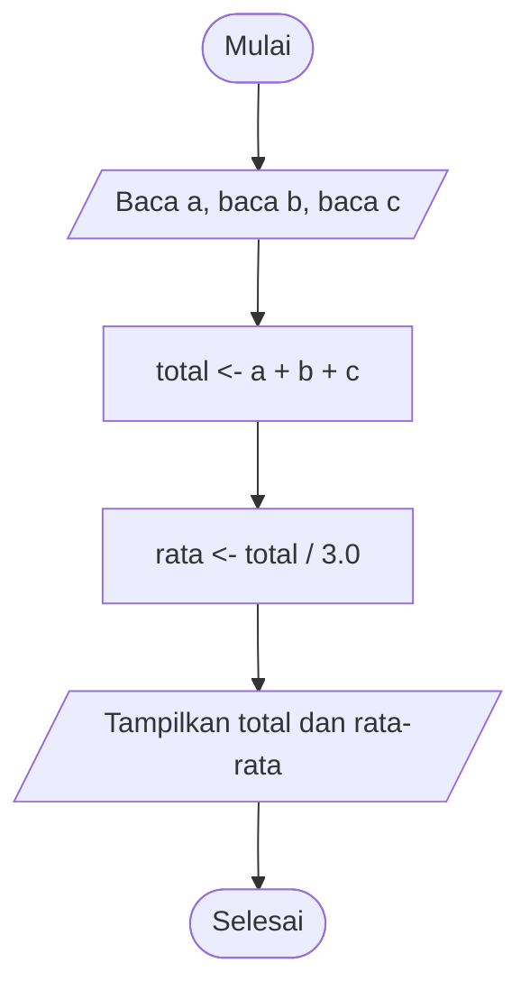
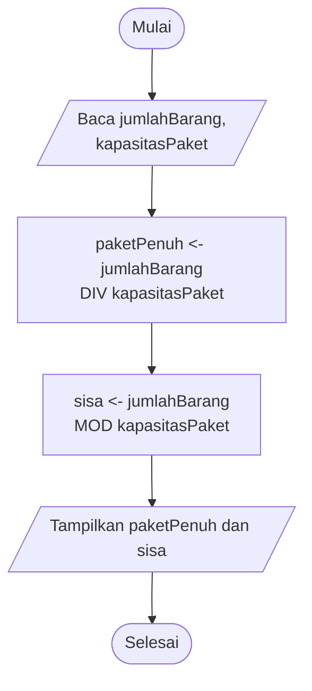
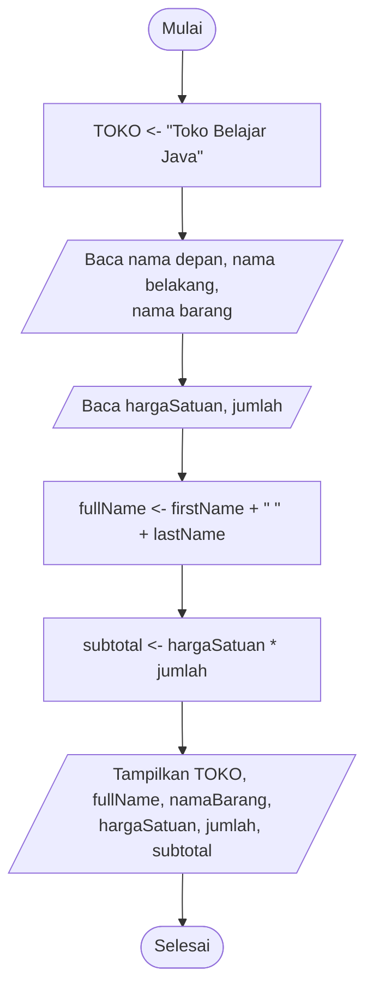

# Pseudocode dan Flowchart - Latihan Soal C0 sampai C4 (Java)
# Nama : Stefanus Nico P.P NIM : 265314108
## C0 - Starter dan Syntax Repair
 
File: `C0StarterDanSyntaxRepair.java`
 
Program meminta nama dan umur, lalu menampilkan sapaan.
 
### Pseudocode
 
```text
ALGORITMA SapaPengguna
DEKLARASI
    nama : string
    umur : integer
DESKRIPSI
    tampilkan "Nama: "
    baca nama
    tampilkan "Umur: "
    baca umur
    tampilkan "Halo " + nama + ", umur " + umur
```
 
### Flowchart
 

 
---
 
## C1 - Kalkulator Dua Bilangan
 
File: `C1KalkulatorduaBilangan.java`
 
Program membaca dua bilangan bulat, lalu menampilkan hasil enam operasi. Perhatikan perbedaan pembagian bulat (`a / b`) dan pembagian desimal (`a * 1.0 / b`).
 
### Pseudocode
 
```text
ALGORITMA KalkulatorDuaBilangan
DEKLARASI
    a, b : integer
DESKRIPSI
    tampilkan "Masukkan a: "
    baca a
    tampilkan "Masukkan b: "
    baca b
    tampilkan "a + b       = ", a + b
    tampilkan "a - b       = ", a - b
    tampilkan "a * b       = ", a * b
    tampilkan "a / b       = ", a DIV b      { pembagian bulat }
    tampilkan "a * 1.0 / b = ", a / b        { pembagian desimal }
    tampilkan "a % b       = ", a MOD b      { sisa bagi }
```
 
### Flowchart
 

 
---
 
## C2 - Rata-rata Tiga Nilai
 
File: `C2RataRataTigaNilai.java`
 
Program membaca tiga bilangan desimal, menjumlahkannya, lalu membagi total dengan 3.
 
### Pseudocode
 
```text
ALGORITMA RataRataTigaNilai
DEKLARASI
    a, b, c : real
    total, rata : real
DESKRIPSI
    baca a
    baca b
    baca c
    total <- a + b + c
    rata  <- total / 3.0
    tampilkan "Total = ", total
    tampilkan "Rata-rata = ", rata
```
 
### Flowchart
 

 
---
 
## C3 - Membagi Barang ke dalam Paket
 
File: `C3MembagiBarangKedalamPaket.java`
 
Pembagian bulat menghasilkan jumlah paket penuh, dan operator sisa bagi menghasilkan barang yang tidak cukup untuk satu paket.
 
### Pseudocode
 
```text
ALGORITMA MembagiBarangKePaket
DEKLARASI
    jumlahBarang, kapasitasPaket : integer
    paketPenuh, sisa : integer
DESKRIPSI
    tampilkan "Jumlah barang: "
    baca jumlahBarang
    tampilkan "Kapasitas paket: "
    baca kapasitasPaket
    paketPenuh <- jumlahBarang DIV kapasitasPaket
    sisa       <- jumlahBarang MOD kapasitasPaket
    tampilkan "Jumlah paket penuh = ", paketPenuh
    tampilkan "Sisa barang = ", sisa
```
 
### Flowchart
 

 
---
 
## C4 - Identitas Pembeli dan Transaksi Sederhana
 
File: `C4IdentitasPembelidanTransaksiSederhana.java`
 
Program menyimpan nama toko sebagai konstanta, membaca data pembeli dan barang, lalu menghitung subtotal.
 
### Pseudocode
 
```text
ALGORITMA TransaksiSederhana
KONSTANTA
    TOKO <- "Toko Belajar Java"
DEKLARASI
    firstName, lastName, fullName, namaBarang : string
    hargaSatuan, subtotal : real
    jumlah : integer
DESKRIPSI
    tampilkan "Nama depan: "
    baca firstName
    tampilkan "Nama belakang: "
    baca lastName
    tampilkan "Nama barang: "
    baca namaBarang
    tampilkan "Harga satuan: "
    baca hargaSatuan
    tampilkan "Jumlah: "
    baca jumlah
    fullName <- firstName + " " + lastName
    subtotal <- hargaSatuan * jumlah
    tampilkan baris kosong
    tampilkan "Nama toko : ", TOKO
    tampilkan "Pembeli   : ", fullName
    tampilkan "Barang    : ", namaBarang
    tampilkan "Harga     : ", hargaSatuan, " | Jumlah: ", jumlah
    tampilkan "Subtotal  : ", subtotal
```
 
### Flowchart
 

